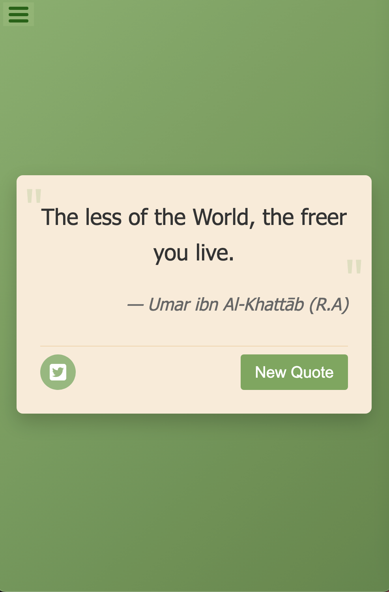
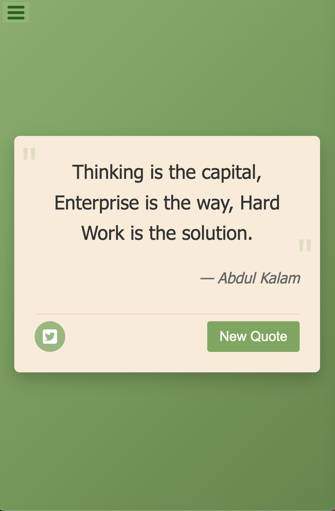

# Random Quote Machine

A simple React application that displays random quotes fetched from an external API. Users can generate new random quotes and share them on Twitter.
<br><br>

## App Preview

<div align="center">
  <table>
    <tr>
      <td align="center">
        
      </td>
      <td align="center">
        
      </td>
    </tr>
  </table>
</div>
<br><br>

## Features

- Displays random quotes with their authors
- Generates new random quotes with a button click
- Allows sharing quotes on Twitter
- Persists quotes and the current random quote in local storage
<br><br>

## Technologies Used

- React 17
- Context API for state management
- Sass for styling
- Vite as the build tool
- localStorage for data persistence
<br><br>

## Project Structure

```
├── app-preview/
│   ├── preview1.png
│   └── preview2.png
├── node_modules/
├── public/
├── src/
│   ├── assets/
│   ├── components/
│   ├── contexts/
│   ├── App.jsx
│   ├── App.scss
│   └── main.jsx
├── .gitignore
├── eslint.config.js
├── index.html
├── package-lock.json
├── package.json
├── README.md
└── vite.config.js
```
<br>

## How It Works

1. The app fetches quotes from the [DummyJSON API](https://dummyjson.com/quotes)
2. Quotes are stored in the React Context API and persisted in localStorage
3. A random quote is selected and displayed in the QuoteBox component
4. When the "New Quote" button is clicked, a new random quote is selected and displayed
5. The "Tweet" button allows sharing the current quote on Twitter
<br><br>

## User Stories

This project fulfills the following user stories:

1. Users can see a wrapper element with id "quote-box"
2. Within #quote-box, there's an element with id "text" that displays the quote
3. Within #quote-box, there's an element with id "author" that displays the author
4. Within #quote-box, there's a clickable element with id "new-quote" to get a new quote
5. Within #quote-box, there's a clickable anchor element with id "tweet-quote" for tweeting the quote
6. On first load, the app displays a random quote in the #text element
7. On first load, the app displays the random quote's author in the #author element
8. When the #new-quote button is clicked, the app fetches a new quote
9. When the #new-quote button is clicked, the app updates the author
10. Users can tweet the current quote by clicking on the #tweet-quote element
<br><br>

## Styling

The app uses Sass for styling with:
- A green primary color theme (#73A857)
- Responsive design that works well on various screen sizes
- Clean, centered layout with appropriate spacing
- Interactive buttons with hover and active states
<br><br>

## Acknowledgments

- [DummyJSON](https://dummyjson.com/) for providing the quotes API
- [Font Awesome](https://fontawesome.com/) for the Twitter icon
- [FreeCodeCamp](https://www.freecodecamp.org/) for the project requirements and testing suite